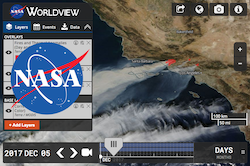
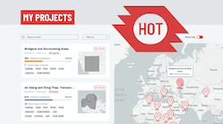
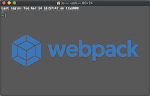
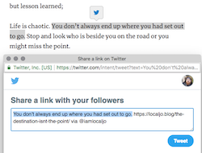

# Code Samples

Here are some samples of my work including live demos, source code and a list of technologies featured.

## Open Source Projects

| Project | 
Links
 | 
Technologies
 |
|:---|:---:|:---|
|<h4>NASA Worldview</h4> An app for browsing full-resolution, global, daily satellite images. Supports environmental science, humanitarian response, climate research and time-critical applications such as wildfire management, air quality and more. |   [Live App](https://worldview.earthdata.nasa.gov/) • [My Contributions](https://github.com/nasa-gibs/worldview/pulls?utf8=%E2%9C%93&q=+is%3Apr+author%3Alocaljo+)|                  |
|<h4>Humanitarian OpenStreetMap MapCampaigner</h4> An app for managing and monitoring field data collection campaigns in OpenStreetMap. |  [Live](https://campaigns.hotosm.org/) • [Contributions](https://github.com/hotosm/MapCampaigner/pulls?utf8=%E2%9C%93&q=is%3Apr+author%3Alocaljo+) • [Blog Post](https://www.hotosm.org/updates/mapcampaigner-gets-new-look-and-features-for-2020/) |        |
|<h4>Webpack Shell Loader</h4>A Webpack loader that I built and maintain for running arbitrary shell scripts when loading files. |  [Code Repo](https://github.com/localjo/shell-loader) • [NPM Package](https://www.npmjs.com/package/shell-loader) |   |
|<h4>Quotable WordPress Plugin</h4>A five-star WordPress plugin I built and maintain for sharing quotes on Twitter. |   [Code Repo](https://github.com/localjo/quotable-wp) • [WordPress Plugin Directory](https://wordpress.org/plugins/quotable/)|      |
| |&nbsp;&nbsp;&nbsp;&nbsp;&nbsp;&nbsp;&nbsp;&nbsp;&nbsp;&nbsp;&nbsp;&nbsp;&nbsp;&nbsp;&nbsp;&nbsp;&nbsp;&nbsp;&nbsp;&nbsp;&nbsp;&nbsp;&nbsp;&nbsp;&nbsp;&nbsp;&nbsp;&nbsp;&nbsp;&nbsp;&nbsp;&nbsp;&nbsp;&nbsp;&nbsp;&nbsp;&nbsp;&nbsp;&nbsp;&nbsp;&nbsp;&nbsp;&nbsp;&nbsp;&nbsp;&nbsp;&nbsp;&nbsp;&nbsp;&nbsp;&nbsp;&nbsp;&nbsp;&nbsp;&nbsp;&nbsp;&nbsp;&nbsp;&nbsp;|&nbsp;&nbsp;&nbsp;&nbsp;&nbsp;&nbsp;&nbsp;&nbsp;&nbsp;&nbsp;&nbsp;&nbsp;&nbsp;&nbsp;&nbsp;&nbsp;&nbsp;&nbsp;&nbsp;&nbsp;&nbsp;&nbsp;&nbsp;&nbsp;&nbsp;&nbsp;&nbsp;&nbsp;&nbsp;&nbsp;&nbsp;&nbsp;&nbsp;&nbsp;&nbsp;&nbsp;&nbsp;&nbsp;&nbsp;&nbsp;&nbsp;&nbsp;&nbsp;&nbsp;&nbsp;&nbsp;&nbsp;&nbsp;&nbsp;&nbsp;&nbsp;&nbsp;&nbsp;&nbsp;&nbsp;&nbsp;&nbsp;&nbsp;&nbsp;&nbsp;&nbsp;&nbsp;&nbsp;&nbsp;&nbsp;&nbsp;&nbsp;&nbsp;|

## Demos

| Project | Year | 
Links
 | 
Technologies
 |
|:---|:---:|:---:|:---|
| <h4>Tater 🥔</h4> A React plugin to add emoji markers and annotations to any element on a page. With algorithms for collision detection and finding nearest points. Includes extensive documentation of my technical choices. | 2020 | [NPM Package](https://www.npmjs.com/package/react-tater)   [Live Demo](https://iamlocaljo.com/graphy-react-challenge/)   [Technical Docs](https://github.com/localjo/graphy-react-challenge) |          |
| <h4>Trivia Demo</h4> A trivia app demo I built that gets a list of true/false trivia questions from a JSON API and presents them in one at a time with animations, showing the player's score at the end. | 2020 | [Code Repo](https://github.com/localjo/trivia-demo)   [Live Demo](https://iamlocaljo.com/trivia-demo/) |         |
| <h4>Giphy Signal</h4> A lightweight GIF search engine that uses the Giphy API and allows users to quickly search for GIFs as they type. | 2019 | [Code Repo](https://github.com/localjo/giphy-signal)   [Live Demo](https://giphy-signal.herokuapp.com/) |         |
| <h4>Ethereum App Demo</h4> I built this app to learn Solidity. It mimics a simple Twitter poll with the votes being tracked on the Ethereum blockchain. | 2017 | [Code Repo](https://github.com/localjo/ethereum-app-demo) |     |
| <h4>Kanban Demo</h4> A basic Kanban board I built as a Trello clone using React Hooks, React Context and React Drag n Drop. | 2019 | [Code Repo](https://github.com/localjo/kanban-takehome)   [Live Demo](http://iamlocaljo.com/kanban-takehome/) |      |
| <h4>NASA Worldview Layers Search Component (Demo)</h4>   A demo of a very fast search component I built while working on NASA Worldview to show how an existing codebase can be migrated to React one component at a time. | 2017 | [Code Repo](https://github.com/localjo/layers-search)   [Live Demo](http://iamlocaljo.com/layers-search/) |     |
| <h4>Encyclopedia CLI</h4> A demo application that allows reading a Wikipedia from the command line. Supports any MediaWiki instance and language. | 2019 | [Code Repo](https://github.com/localjo/encyclopedia-cli) |       |
| <h4>OCR Bank Kata</h4> My solution to [this Coding Dojo challenge](http://codingdojo.org/kata/BankOCR/). | 2018 | [Code Repo](https://github.com/localjo/ocr-bank) |  |
| <h4>Table Sorter (Demo)</h4> A very old code sample, a pure JS table sorter using QUnit for tests and Bootstrap for styles. | 2014 | [Code Repo](https://github.com/localjo/table-sorter)   [Live Demo](http://iamlocaljo.com/table-sorter/) |     |
| | |&nbsp;&nbsp;&nbsp;&nbsp;&nbsp;&nbsp;&nbsp;&nbsp;&nbsp;&nbsp;&nbsp;&nbsp;&nbsp;&nbsp;&nbsp;&nbsp;&nbsp;&nbsp;&nbsp;&nbsp;&nbsp;&nbsp;&nbsp;&nbsp;&nbsp;&nbsp;&nbsp;&nbsp;&nbsp;&nbsp;&nbsp;&nbsp;&nbsp;&nbsp;&nbsp;&nbsp;&nbsp;&nbsp;&nbsp;|&nbsp;&nbsp;&nbsp;&nbsp;&nbsp;&nbsp;&nbsp;&nbsp;&nbsp;&nbsp;&nbsp;&nbsp;&nbsp;&nbsp;&nbsp;&nbsp;&nbsp;&nbsp;&nbsp;&nbsp;&nbsp;&nbsp;&nbsp;&nbsp;&nbsp;&nbsp;&nbsp;&nbsp;&nbsp;&nbsp;&nbsp;&nbsp;&nbsp;&nbsp;&nbsp;&nbsp;&nbsp;&nbsp;&nbsp;&nbsp;&nbsp;&nbsp;&nbsp;&nbsp;&nbsp;&nbsp;&nbsp;&nbsp;&nbsp;&nbsp;&nbsp;&nbsp;&nbsp;&nbsp;&nbsp;&nbsp;&nbsp;&nbsp;&nbsp;&nbsp;&nbsp;&nbsp;&nbsp;&nbsp;&nbsp;&nbsp;&nbsp;&nbsp;|

Thank you for taking the time to look at my work. If you'd like to see more, check out [my GitHub profile](https://github.com/localjo).
